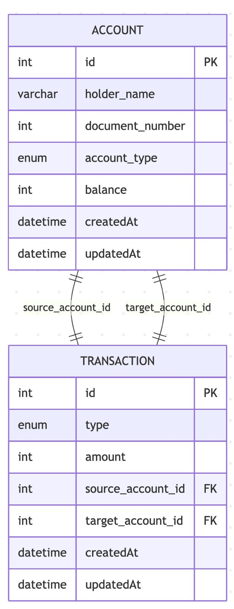

## proyecto NestJS monorepo servicios financieros  
#### proyecto basado en NestJS usando configuracion monorepo con 2 servicios+postgres

### Descripcion
Este proyecto es un monorepo basado en NestJS que sigue una arquitectura modular y escalable. Está organizado en dos aplicaciones principales dentro del directorio apps: account-app y transaction-app, cada una con su propio Dockerfile, configuración TypeScript (tsconfig.app.json), y carpetas de src y test para el código fuente y pruebas, respectivamente. Además, el proyecto cuenta con una librería compartida en libs/shared, diseñada para contener lógica reutilizable entre las distintas aplicaciones.

#### Este proyecto cuenta con las siguientes caracteristicas:

1. Cuenta con validaciones usando **class-validator**
2. Cuenta con manejo de errores y excepciones
3. Cuenta con Documentacion swagger.
4. Dockerfiles + Docker compose
5. Cuenta con tests.
6. Postgres como base de datos + sqlLite en memoria como DB para tests.
7. Seeds basicos para tests
8. Cuenta con un simple middleware para logging.
  

#### Este proyecto cuenta con las siguientes rutas:

##### Rutas Servicio 'accounts'

● Crear cuenta (POST /accounts)

● Consultar cuenta (GET /accounts/:id) 

● Listar cuentas (GET /accounts) 

##### Rutas Servicio 'transaction'

● Depósito (POST /transactions/deposit) 

● Retiro (POST /transactions/withdraw) 

● Transferencia (POST /transactions/transfer) 

● Listar transacciones de una cuenta (GET /transactions/:accountId) 


## Diseño

El sistema está compuesto por dos entidades principales:
- Account: representa una cuenta bancaria con atributos como el nombre del titular, número de documento, tipo de cuenta (ahorro o corriente) y saldo disponible.
- Transaction: representa una transacción bancaria, la cual puede ser un depósito, retiro o transferencia. Cada transacción puede estar relacionada con una cuenta de origen y/o una cuenta de destino, lo que permite modelar operaciones internas entre cuentas.




## Project setup

#### usando docker compose
```bash
$ docker compose build
$ docker compose up
```
#### sin docker compose

1. habilita tu db postgres
2. usar .env-example como .env
3. instala dependencias: npm i 
4. levante primer servicio:  npm run start:dev account-app
4. levante segundo servicio:  npm run start:dev transaction-app


## Tests

sqlLite en memoria
```bash
# unit tests
$ npm run test
```

## Documentation (swagger)

- http://localhost:4001/api
- http://localhost:4002/api 
